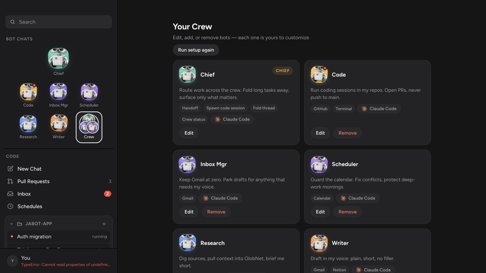

# Animated mascot avatars

`after.png` shows the merged Crew view with the supplied JaBot mascot used for
every default bot icon. The sidebar, Crew cards, and three-mascot Crew cluster
retain the bot colour variations from the current avatar system.

The live browser check also confirmed that the mascot animation transform
changes over time, all images load, and no Vite error overlay or browser
warning is present.

