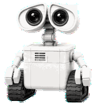
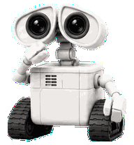
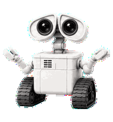
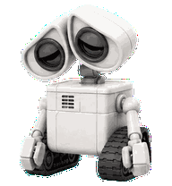
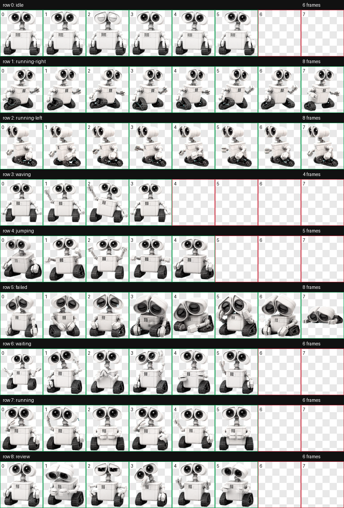

# Animated mascot avatars

`after.png` shows the Crew view with the supplied JaBot mascot used for every
default bot icon. The sidebar, Crew cards, and three-mascot Crew cluster retain
the bot colour variations from the current avatar system.

The mascot now uses a validated frame atlas rather than moving one still image
back and forth. Idle blinks and breathes, running works with its head and
grippers, waiting asks for attention, and failed slumps with closed eyes. The
avatar wells remain still while the rendered character poses advance.

| Idle | Running | Waiting | Failed |
| --- | --- | --- | --- |
|  |  |  |  |

