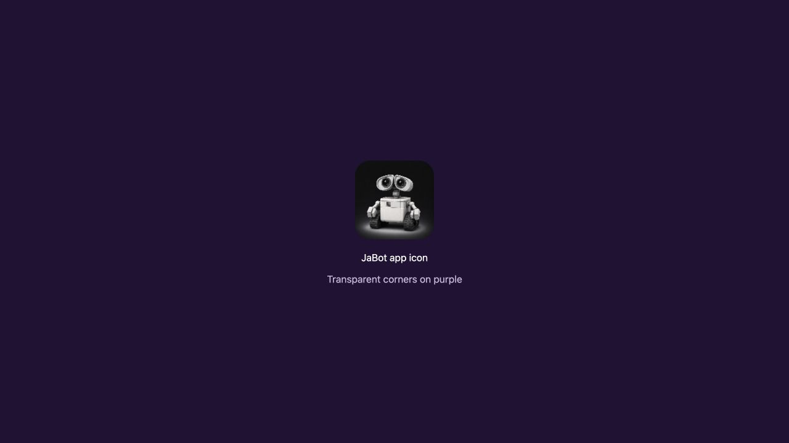

# Transparent app icon corners

`src-tauri/icons/app-icon.svg` is the canonical export source. It embeds the original robot artwork and clips away the white area outside the rounded square. The original `app-icon.png` is retained as artwork input, not an export source.

Regenerate with `npm run tauri icon -- src-tauri/icons/app-icon.svg --output /tmp/jabot-icons`, then copy the existing desktop icon filenames into `src-tauri/icons/`. Copy `128x128.png` to `public/app-icon.png` and `32x32.png` to `public/favicon.png`.

The screenshot was captured from `preview.html` served by the running Vite development app. All desktop and web icon files, including ICO and ICNS, were checked for zero alpha at all four corners. Tauri dev automatically rebuilt after the icon update. The screenshot verifies the served asset, not the macOS Dock itself.
