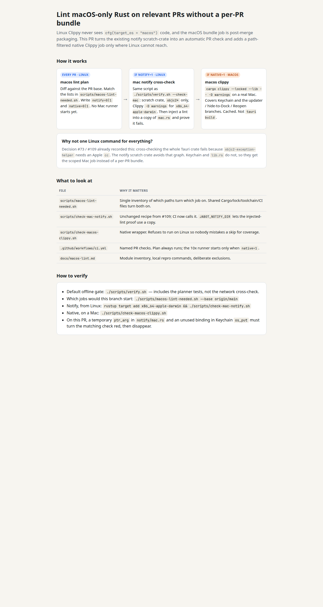

# PR #240 walkthrough

How before-merge macOS Rust lint works: Linux planner, notify scratch-crate,
scoped native Clippy. Open [walkthrough.html](walkthrough.html) in a browser.

Coverage and local commands: [`docs/macos-lint.md`](../../macos-lint.md).

