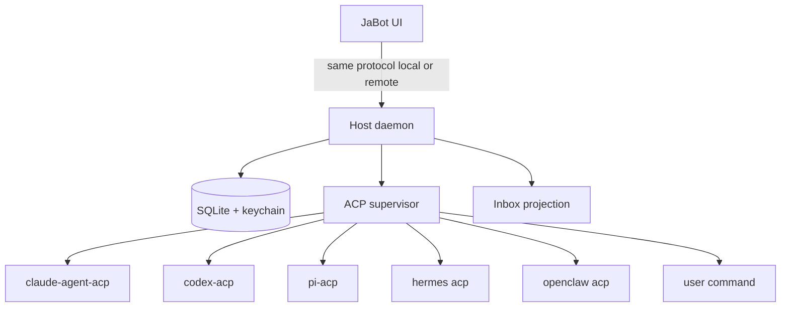

# Setup Porting — Findings

Researched 2026-08-19 from current official docs and source (OpenClaw `main`,
Hermes Agent ~0.20.4, Buzz `main`). Deep dives:
[openclaw.md](openclaw.md), [hermes.md](hermes.md), [buzz.md](buzz.md).

**Recommendation in one sentence:** JaBot should port a **thin UI + durable host
daemon** that speaks ACP to harnesses (Buzz's seam), treat **crew as isolated
scopes** with persona/tools/memory policy (OpenClaw agents / Hermes profiles),
and keep **fold, run, and Inbox as three stores** — not one "session" flag.

Do not port OpenClaw's channel catalog, Hermes's 20-platform gateway, or Buzz's
Nostr/Postgres/team workspace.

| Question | Short answer | Detail |
|---|---|---|
| 1. Host vs UI | Yes: all three separate a long-lived host from clients. JaBot should too, even locally. | [Architecture](#architecture-to-copy) |
| 2. What is a bot? | Isolated scope (workspace, persona, tools, memory), not a system prompt. Templates instantiate it. | [Crew mapping](#crew--bot-model) |
| 3. Fold vs run vs Inbox | Fold is UI. Runs/tasks are durable. Inbox is a projection of run events. | [Session / Inbox](#sessions-runs-inbox) |
| 4. Harness catalog | Three-tier BYOH + PATH/auth Doctor. Hermes = `hermes acp`; OpenClaw = `openclaw acp`. | [Harness catalog](#harness-catalog) |
| 5. Permissions | Interactive ACP `request_permission`. Never auto-`allow_once` because a thread is folded. | [Permissions](#permissions--what-not-to-copy) |
| 6. Memory / skills / tools | Three entities: capability, skill package, credential. Skills are not authorization. | [Tools skills memory](#tools-skills-memory) |
| 7. Pairing / remote | QR + SAS + revocable device grant. Same protocol local and remote. No master-secret copy. | [Remote](#remote--pairing) |
| 8. Persistence | Host-owned SQLite + files + OS keychain. Clients hydrate on reconnect; events are live hints. | [Data](#data--secrets) |

## Architecture to copy

```text
JaBot desktop / later mobile
        │  typed local protocol (same as remote)
        ▼
JaBot host daemon          ← OpenClaw Gateway, Hermes gateway/serve, Buzz desktop native
        │  owns SQLite, keychain, process trees, Inbox projection
        ├── ACP stdio ── Claude / Codex / Pi / Hermes / OpenClaw / Custom
        └── MCP / tools the *host* selected (not ambient harness MCP)
```

All three products already look like this. Hermes Desktop is Electron talking
JSON-RPC to `hermes serve`. OpenClaw's macOS app manages a LaunchAgent Gateway
and does **not** stop it when the UI quits. Buzz's renderer never talks to
Claude/Codex; Tauri spawns `buzz-acp`.

Implications for [app-shell](../app-shell/brief.md): Electron vs Tauri is a
packaging choice. The durable host is not. Folded work that dies when the
window closes is a product bug, not a shell limitation.



## Crew / bot model

| Product | Unit | Isolation | Routing |
|---|---|---|---|
| OpenClaw | `agents.entries.<id>` | Own workspace, `SOUL.md`/`AGENTS.md`/`USER.md`, SQLite, tools, skills | Channel **bindings** |
| Hermes | Profile / Desktop **Bot** | Own `HERMES_HOME`: config, `.env`, memory, skills, `state.db`, cron | Bot Mode roster; groups 2–6 |
| Buzz | Persona pack + managed-agent **keypair** | Prompt + skills + MCP + subscribe/triggers | Channel membership + mentions |
| **JaBot** | Crew template → instance | Persona, tool policy, memory policy, default harness, workspace | User pick + Chief spawn |

Port:

1. A bot is a **scope**, not a prompt. Never share auth/session stores across crew.
2. **Canonical relationship chats** (Hermes Bot Chat / OpenClaw main session as
   *Chief's* root only). Scratch threads are separate; `/new` should compact, not
   erase the relationship.
3. **Chief orchestrates; workers have their own transcripts.** OpenClaw's default
   of collapsing every DM into one main transcript is the wrong default for JaBot.
4. Hermes `delegate_task` / OpenClaw `sessions_spawn` = ephemeral fan-out, **not**
   a crew member. Running children generally die on process crash; completed
   results can be durable.
5. Skills teach workflow; tools grant capability; credentials authorize. Installing
   `SKILL.md` must not imply `exec` or Gmail.

Skip: OpenClaw/Hermes "connect every chat platform." Slack is a tool, not JaBot's
messenger. Buzz cryptographic keypairs per bot — local UUIDs until remote auth
needs real device/host keys.

## Sessions, runs, Inbox

The three products all split conversation from work, even if the UI hides it:

| Layer | OpenClaw | Hermes | Buzz | JaBot should |
|---|---|---|---|---|
| Conversation | Per-agent SQLite session | `state.db` sessions | Relay channel/thread | Thread row + ACP `sessionId` |
| Work | Task ledger (`queued→…→lost`) | Background jobs, cron, async delegations | Agent job kinds; ACP in-flight prompt | Run row with execution + delivery |
| Visibility | Control UI companion thread | Hidden Bots + "Active now" | Tray / agent activity | Fold flag — UI only |
| Resume | Native runtimes auto-recover; **ACP does not** | ACP sessions in `state.db` (docs disagree with source) | Channel→session **in memory**; PR #6088 still open | Persist receipts with a compatibility fingerprint |

Inbox consumes **run events**, not fold:

- succeeded / failed / timed_out / lost
- permission / `ask_user` / "needs you"
- stalled / no-progress
- PR opened (later)

Persist the event **before** notifying the UI (Buzz relay pipeline; Hermes
gateway delivery ledger). Notification failure must not lose the result.

Folded + still working ⇒ keep the ACP subprocess (Buzz supervisor). Folded +
pending permission ⇒ resurface as Inbox "needs you", **do not auto-allow**.

## Harness catalog

Extend [harness-integration/adapter-design.md](../harness-integration/adapter-design.md)
with Buzz's three tiers and OpenClaw/Hermes as first-class presets:

| Card / id | Command | Args | Host env | Probe |
|---|---|---|---|---|
| Claude | `claude-agent-acp` (fallback `claude-code-acp`) | — | existing Claude login | `claude auth status` |
| Codex | `codex-acp` | — | existing `codex login` | `codex login status` |
| Pi | `omp acp` or `npx -y pi-acp` | verify at implement time | `pi` on PATH | handshake |
| Hermes | `hermes` | `acp` (or `-p <profile> acp`) | `HERMES_ACP_SKIP_CONFIGURED_MCP=1` | `hermes acp --check`; terminal `--setup` |
| OpenClaw | `openclaw` | `acp` | Gateway must be running; token/url | `openclaw gateway status` — PATH-only is a false ready |
| Custom | user JSON | user | floor env; strip host-reserved keys | ACP `initialize` |

Doctor must distinguish: CLI missing, adapter missing, adapter outdated, logged
out, invalid config, **daemon not running** (OpenClaw). GUI apps inherit a
starved PATH — copy Buzz's login-shell + `~/.local/bin` + nvm augmentation.

Custom JSON: copy Buzz's schema (`id`, `label`, `command`, `args`, `env`,
install hint/URL). No install scripts. Reserved ids cannot be shadowed.

One long-lived ACP process **per Hermes profile**, not per JaBot chat — Hermes
warns concurrent writers to one `HERMES_HOME`. Multiplex chats via ACP sessions.

## Permissions — what not to copy

| Source | Default / trap | JaBot |
|---|---|---|
| Buzz `buzz-acp` | CLI default `bypass-permissions`; if a prompt arrives, pick `allow_once` | Interactive Allow / Always / Deny / Never |
| Buzz + Hermes | Bridge auto-`allow_once`; `approvals.mode: manual` does **not** fix it | Host must answer; folded = Inbox, never silent allow |
| OpenClaw acpx | Non-interactive: `approve-reads` + `fail` (writes abort) | We own a UI; implement `session/request_permission` |
| Hermes `smart` | Auxiliary LLM classifies dangerous commands | Classifier may annotate; policy + user decide |
| Grok preset | `--always-approve` in args | Do not inherit unnoticed |

Timeouts deny. Cancellation replies `cancelled` to outstanding permission
requests, then `session/cancel`.

## Tools, skills, memory

Port the **taxonomy**, not Hermes's 70 tools or OpenClaw's channel plugins.

| Entity | OpenClaw | Hermes | JaBot |
|---|---|---|---|
| Capability | Built-in tools + MCP; allow/deny before the model sees the schema | Toolsets + MCP `mcp_<server>_<tool>` | Host-owned tool policy per bot |
| Skill | `SKILL.md`; not a security boundary | agentskills.io; progressive `skills_list` / `skill_view` | Crew asset with provenance + trust |
| Memory | `USER.md` / `MEMORY.md` / daily notes + index | Bounded MEMORY/USER + FTS5 history + optional provider | Always-on facts, user prefs, searchable history, optional semantic, skills |
| Credential | SecretRefs (`env`/`file`/`exec`/`store`) | `.env` + `auth.json` + mcp-tokens `0600` | OS keychain; opaque refs in SQLite |

Gmail / Calendar / Drive: both OpenClaw and Hermes use a Google Workspace CLI
skill (`gog` / `gws`), not a magic tool. GitHub: reuse `gh auth` + `--json`.
Notion: `ntn`. Browser and Terminal: native tools with a separate security
boundary. Slack: connector, not the product's chat.

Host-selected MCP is authoritative. Copy Buzz/Hermes
`HERMES_ACP_SKIP_CONFIGURED_MCP=1` as a **general rule** for every harness that
has ambient MCP.

A workspace/`cwd` is not a sandbox. OpenClaw ACP runs on the host; Hermes
profiles share the real OS `HOME` unless `terminal.home_mode: profile`.
Approval and sandboxing are separate axes.

## Remote / pairing

| Copy | From | Skip |
|---|---|---|
| Local = "client and host on one machine"; remote = same protocol | OpenClaw, Hermes Desktop machines | Exposing ACP stdio on the network |
| Device keypair + one-time code + SAS + revoke | Buzz NIP-AB *mechanics*; OpenClaw device pairing | Copying the host master secret (Buzz QR payload includes `nsec`) |
| Mobile is an Inbox/chat/approval client, not a harness spawner | All three | Shipping iOS/Android node camera/screen APIs in MVP |
| Tailscale/VPN as assumed underlay | OpenClaw remote, Hermes peers | Building a public relay |

Pairing payload JaBot should issue:

```json
{
  "deviceId": "...",
  "devicePublicKey": "...",
  "scopes": ["read_chats", "send_messages", "approve_permissions"],
  "grantId": "...",
  "expiresAt": "..."
}
```

OpenClaw layers pairing (DM sender vs device vs node capabilities). JaBot needs
the device/grant layer; not WhatsApp sender codes.

TLS/VPN is transport security. Application E2EE was **not** confirmed in the
fetched OpenClaw/Hermes docs. Decide the threat model before claiming E2EE.

## Data / secrets

| Buzz production | JaBot local-first |
|---|---|
| Postgres + Redis + S3/MinIO | SQLite + files + OS keychain |
| Signed Nostr event log | Typed tables, persist-then-notify |
| Per-agent nsec in keyring | Provider tokens + host/device keys in keychain |

Minimum tables: threads, messages/run_events, runs, inbox_items, crew,
harness_defs, session_receipts, device_grants.

Transcript policy: **mirror ACP events into JaBot SQLite**. Depending only on
`~/.claude` / Codex / Hermes `state.db` makes remote clients and migrations
brittle. Store native IDs as overlay (already in adapter-design).

Never put tokens in templates, transcripts, ACP prompts, or `environment.json`.

## What to port, by JaBot topic

### harness-integration (extends existing findings)

1. Three-tier catalog + custom JSON (Buzz).
2. PATH/auth/daemon Doctor; concurrent probes (Buzz; OpenClaw gateway status).
3. Hermes preset: `hermes acp` + skip ambient MCP + `--check`/`--setup`.
4. OpenClaw preset: `openclaw acp` talks to a Gateway; false-ready if daemon down.
5. Interactive permission broker; cancel resolves pending prompts.
6. Steer vs cancel-and-redispatch when the user talks to an in-flight folded run (Buzz).

### session-lifecycle

7. Fold ≠ kill. Run ledger independent of thread visibility (OpenClaw tasks).
8. Inbox from durable transitions, including permission and lost/unknown.
9. Session receipts with compatibility fingerprint (harness, model, cwd, tools,
   permission mode, prompt/template). Buzz's in-memory map is a bug to avoid
   ([issue #5342](https://github.com/block/buzz/issues/5342)).
10. After host crash, ACP work is **unknown** unless the adapter proves
    load/resume. OpenClaw documents this; Hermes docs and source currently
    disagree — feature-test.

### app-shell

11. Renderer is presentation. Host owns processes, secrets, SQLite.
12. Unix process groups / Windows Job Objects; owner marker + nonce; orphan
    sweep by marker, not binary name (Buzz).
13. launchd/systemd so the host outlives the window (OpenClaw macOS).
14. Do not pick Tauri *because* Buzz did, or Electron *because* Hermes did.

### bot-crew

15. Crew template schema: identity, persona files or prompt, tool policy,
    default harness, memory policy, skills, routines.
16. Chief root session receives compact completion notices; child transcripts stay.
17. Bounded group rounds (Hermes 2–6 bots, caps, pass, `@user`) if we ship
    crew deliberation — JaBot owns the scheduler so Claude/Codex can join.
18. Cron/routines as jobs with delivery to a thread or Inbox (both OpenClaw and Hermes).

### git-and-prs

19. Record repo, worktree, branch, host, cwd at spawn. Never infer later.
20. Reuse `gh`; persist thread↔PR. Do not become a git host (Buzz forge vision).

### data-and-persistence

21. Single-writer SQLite; outbox for client sends and Inbox delivery.
22. Reconnect hydrates from the host; live events are hints (OpenClaw protocol).
23. Keychain with `0600` file fallback (Buzz). SecretRefs conceptually (OpenClaw).

### remote-and-mobile

24. Same protocol local and remote. ACP stays on the selected host.
25. QR + SAS + revocable scoped grant. Biometric for sensitive actions (Buzz mobile).
26. Mobile MVP2: Inbox + chat + permission answers. Not harness spawn.

## What not to port

1. OpenClaw/Hermes external-channel gateways (WhatsApp, Telegram, …).
2. One universal transcript for every DM (OpenClaw main session).
3. OpenClaw's embedded model loop or native-Codex exception — JaBot stays ACP-uniform.
4. PTY-scraping TUIs (Hermes dashboard Chat tab; any Ink/Ratatui wrap).
5. Buzz Nostr relay, Postgres/Redis/S3, per-bot keypairs, forums, huddles.
6. `bypass-permissions`, `--always-approve`, silent `allow_once`.
7. Skills or profiles as sandboxes / authorization.
8. Automatic memory "dreaming" without review (OpenClaw); unattended memory writes (Hermes).
9. In-process `AIAgent` import; reading Hermes `state.db` or OpenClaw SQLite internals.
10. Master nsec/token in a pairing QR.
11. Plugin marketplaces and user-supplied install scripts.
12. Assuming workspace = confinement.

## Open questions still blocking issues

1. **Quit policy:** stop all local runs, keep a background daemon, or require a
   remote host? OpenClaw keeps the Gateway; Buzz stops agents on true Quit;
   Hermes children do not survive process death.
2. **Per-adapter `session/load` proof** for Claude, Codex, Pi, Hermes, OpenClaw.
3. **Electron process-tree kill on Windows** — may need a small native helper.
4. **Worktree per run vs shared cwd** — concurrency, cleanup, PR linking.
5. **Application E2EE** vs TLS + Tailscale.
6. Pin versions: all three codebases are moving faster than their docs
   (OpenClaw "Unreleased" schemas; Hermes ACP persistence; Buzz timeout names
   and search stack drift).

## Suggested first issues (after this topic)

1. Host daemon process + SQLite + reconnect hydrate (app-shell + data).
2. Runtime catalog: three builtins + Hermes + OpenClaw presets + custom JSON.
3. Run ledger + Inbox projection; fold is a visibility bit.
4. Permission modal + folded-thread resurface; no auto-allow.
5. Crew template schema (persona, tools, harness, memory policy).
6. Device pairing design (QR/SAS/grant) — implement when remote starts, but
   keep the host protocol compatible.
