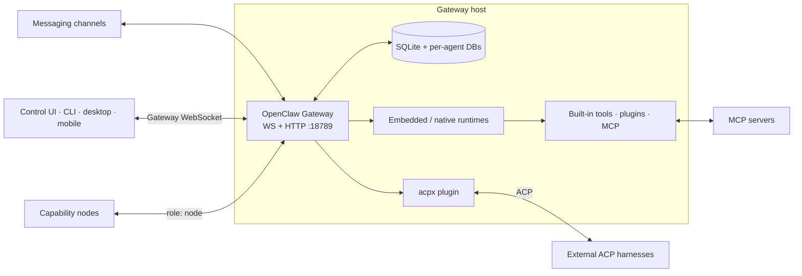

# OpenClaw setup (prior art)

Feeds [findings.md](findings.md). Researched 2026-08-19 against OpenClaw’s
current official documentation and `main`. Several docs describe unreleased
database schemas and rapidly changing runtime behavior; version-pin anything
JaBot copies.

## 1. What OpenClaw is

OpenClaw is a self-hosted personal AI-assistant gateway. One long-lived Gateway
connects messaging channels (WhatsApp, Telegram, Slack, Discord, Signal,
iMessage, WebChat, …) to agent runtimes, tools, sessions, and companion
devices. It is for one operator who wants an assistant across existing chat
apps while retaining control of the host and data. The Gateway is the source of
truth for sessions, routing, channels, and connected clients.
([Overview](https://docs.openclaw.ai/),
[README](https://raw.githubusercontent.com/openclaw/openclaw/main/README.md))

| | OpenClaw | JaBot |
|---|---|---|
| Primary product | Gateway into existing messaging systems | Purpose-built personal bot-crew messenger |
| Organizing unit | Agent, channel account, binding, session | Chief of Staff, crew bot, project/thread, Inbox |
| UI | Browser Control UI + native companions + existing chats | Desktop-first owned chat UI |
| Runtime | Embedded loop, native plugins, ACP harnesses | ACP-first for Claude Code, Codex, Pi, Custom |
| Background UX | Tasks, subagents, automations, notifications | Folding threads that resurface in Inbox |
| Remote | One authoritative Gateway; apps are clients/nodes | Planned local host daemon, later remote hosts + mobile |

The overlap is the daemon/client split, durable sessions and tasks, ACP process
supervision, pairing, and single-writer persistence — not OpenClaw’s channel
catalog.

## 2. Architecture



The Gateway is a long-lived daemon, default `127.0.0.1:18789`. One Gateway per
host. Typed WebSocket: `req` / `res` / `event`. First exchange is a
challenge-bound `connect`; success returns `hello-ok`. Side-effecting calls
need idempotency keys. Events are not generally replayed — reconnecting clients
reload authoritative session/history. Wire version documented as `4`.
([Architecture](https://docs.openclaw.ai/concepts/architecture),
[Protocol](https://docs.openclaw.ai/gateway/protocol),
[Clients](https://docs.openclaw.ai/gateway/clients))

OpenClaw separates **provider**, **model**, **agent runtime/harness**, and
**channel**. Embedded runtime serializes per session and streams `assistant` /
`tool` / `lifecycle` events. External coding harnesses run through ACP/acpx.
([Agent loop](https://docs.openclaw.ai/concepts/agent-loop),
[Runtimes](https://docs.openclaw.ai/concepts/agent-runtimes))

Operator clients project Gateway-owned state. Nodes connect with
`role: "node"` and advertise device capabilities. A mobile node is not a second
Gateway. ([Session attachment](https://docs.openclaw.ai/concepts/session-attachment))

## 3. Setup / install / config

Supported Node: 22.22.3+, 24.15+, 25.9+ (26 recommended).
([Install](https://docs.openclaw.ai/install))

```bash
curl -fsSL https://openclaw.ai/install.sh | bash
# or
npm install -g openclaw@latest --allow-scripts=openclaw
openclaw onboard --install-daemon
```

`openclaw onboard` is now inference-first (detect model access, verify a real
completion, then configure workspace/Gateway/channels). `--classic` is the
full wizard. Daemon: LaunchAgent (macOS), systemd user (Linux/WSL2), Scheduled
Task (Windows). Remote mode configures a *client* for an existing Gateway and
does not modify that host. ([Wizard](https://docs.openclaw.ai/start/wizard))

| Purpose | Default |
|---|---|
| Config | `~/.openclaw/openclaw.json` (`OPENCLAW_CONFIG_PATH`) |
| State | `~/.openclaw` (`OPENCLAW_STATE_DIR`) |
| Main workspace | `~/.openclaw/workspace` |
| Global DB | `~/.openclaw/state/openclaw.sqlite` |
| Per-agent DB | `~/.openclaw/agents/<id>/agent/openclaw-agent.sqlite` |
| Skills | `~/.openclaw/skills/` |
| Channel credentials | `~/.openclaw/credentials/` |

```bash
openclaw config schema
openclaw config validate
openclaw doctor
openclaw gateway status
```

Plugin-entry changes require a Gateway restart. `plugins.allow`, when present,
is exclusive; `plugins.deny` wins.

Representative (reduced) config:

```json5
{
  agents: {
    defaults: {
      workspace: "~/.openclaw/workspace",
      model: { primary: "anthropic/claude-sonnet-4-6" },
    },
    entries: {
      main: { default: true, identity: { name: "Chief", emoji: "🧭" } },
      research: {
        workspace: "~/.openclaw/workspace-research",
        tools: { allow: ["read", "web_search"], deny: ["exec", "write"] },
      },
    },
  },
  bindings: [
    { type: "route", agentId: "main", match: { channel: "telegram", accountId: "default" } },
  ],
  session: {
    dmScope: "per-channel-peer",
    threadBindings: { enabled: true, idleHours: 24, spawnSessions: true },
  },
  plugins: {
    allow: ["acpx"],
    entries: {
      acpx: {
        enabled: true,
        config: {
          permissionMode: "approve-reads",
          nonInteractivePermissions: "deny",
        },
      },
    },
  },
}
```

([Multi-agent](https://docs.openclaw.ai/concepts/multi-agent),
[Config agents](https://docs.openclaw.ai/gateway/config-agents))

## 4. Agent model

An OpenClaw agent is a per-persona isolation scope: workspace, bootstrap files,
auth/model state, skills, tool/sandbox policy, per-agent SQLite. Never reuse
`agentDir` between agents. The workspace is **not** a security sandbox —
absolute paths remain reachable unless sandboxing/OS isolation is on.

| File | Meaning |
|---|---|
| `AGENTS.md` | Operating instructions |
| `SOUL.md` | Persona, tone, boundaries |
| `IDENTITY.md` | Name, vibe, emoji |
| `USER.md` | Stable user preferences |
| `BOOTSTRAP.md` | First-run ritual |
| `MEMORY.md` | Curated long-term memory |
| `memory/YYYY-MM-DD.md` | Daily notes |
| `skills/*/SKILL.md` | Workspace-local skills |

Injected into the prompt under character budgets. Memory is durable Markdown
plus a searchable index; optional “dreaming” consolidation is not authorization.
([Workspace](https://docs.openclaw.ai/concepts/agent-workspace),
[Memory](https://docs.openclaw.ai/concepts/memory))

Bindings map `(channel, accountId, peer, …)` → `agentId`. Most-specific tier
wins; config order breaks ties.

**JaBot mapping:** `main` → Chief of Staff; other entries → crew instances;
`SOUL.md`/`AGENTS.md` → template persona + operating instructions; `skills` →
workflow packs; `tools.allow`/`deny` → capability policy; `bindings` → bot
selection / Chief delegation, **not** WhatsApp routing. Keep templates
declarative (name, color, persona, tools, harness, workspace, memory policy)
and render into harness-specific bootstrap — Markdown files are not the only
source of truth.

## 5. Sessions and lifecycle

Defaults: DMs share the agent’s main session; groups get separate sessions;
cron/webhooks isolated. `session.dmScope`: `main` | `per-peer` |
`per-channel-peer` | `per-account-channel-peer`.
([Sessions](https://docs.openclaw.ai/concepts/session))

Main session is usually keyed `agent:main:main`. Collapsing every user chat
into one transcript is the **wrong default for JaBot**. Useful idea: a
Chief-owned root that receives delegated-work summaries.

Active rows live in per-agent SQLite. Sessions do not auto-reset by default.
Compaction bounds model context; durable history remains.

Background **tasks** are a separate ledger:

```text
queued → running → succeeded | failed | timed_out | cancelled | lost
```

Execution status ≠ result delivery. Default notify `done_only`.
`sessions_spawn` creates isolated background runs; completion announces back.
([Tasks](https://docs.openclaw.ai/automation/tasks),
[Subagents](https://docs.openclaw.ai/tools/subagents))

Restart recovery (native runtimes): conversation durable; interrupted main
turn reconciled; subagents restored; tasks marked lost if orphaned; cron
re-armed. **PTY lost. ACP-managed sessions are not automatically resumed —
the ACP client/IDE owns resume.** Graceful restart drains up to ~5 minutes.
([Restart recovery](https://docs.openclaw.ai/gateway/restart-recovery))

**Inbox takeaway:** folding is UI state, not execution status. Keep a durable
task row. Resurface on success, failure/timeout/lost, permission, structured
ask, stall, or “judgment made.” Push-driven; persist delivery independently.
On restart, reconcile with ACP load/resume — do not claim automatic ACP
recovery.

## 6. Harness / ACP

OpenClaw uses ACP in **two directions**:

| Direction | OpenClaw’s role | Mechanism |
|---|---|---|
| Launches Claude/Codex/… | ACP **host** | `acpx` plugin, `/acp spawn`, `sessions_spawn({runtime:"acp"})` |
| IDE launches `openclaw acp` | ACP **agent** | stdio ACP, forwarded to Gateway over WebSocket |

```bash
openclaw plugins install @openclaw/acpx
openclaw config set plugins.entries.acpx.enabled true
# then in chat: /acp doctor
```

The plugin embeds acpx; some adapters download via `npx` on first use. Vendor
login must already exist on the Gateway host.
([ACP agents](https://docs.openclaw.ai/tools/acp-agents),
[ACP setup](https://docs.openclaw.ai/tools/acp-agents-setup))

Documented aliases include `claude`, `codex`, `copilot`, `cursor`, `droid`,
`gemini`, `opencode`, `openclaw`, `pi`, and others. Availability, auth, model
switching, and `session/load` vary. Test Pi rather than infer parity.

```text
/acp spawn claude --bind here
/acp spawn codex --mode persistent --thread auto --cwd /workspace/repo
/acp permissions strict
/acp cancel
```

`runtime` defaults to `subagent`; ACP must be explicit. `mode: "session"`
requires `thread: true`. `resumeSessionId` uses ACP `session/load`; failure is
explicit, not a silent fresh start.

ACPX is non-interactive from OpenClaw’s perspective:

| `permissionMode` | Effect |
|---|---|
| `approve-all` | Approve writes and shell (marked dangerous) |
| `approve-reads` | Reads yes; writes/exec prompt |
| `deny-all` | Deny all prompts |

| `nonInteractivePermissions` | Effect |
|---|---|
| `fail` | Abort (`PermissionPromptUnavailableError`) |
| `deny` | Deny and degrade |

Defaults `approve-reads` + `fail` — ordinary coding writes may terminate.
**JaBot should not copy this:** we own an interactive UI and should implement
`session/request_permission`.

External harnesses do **not** receive OpenClaw tools by default
(`pluginToolsMcpBridge` / `openClawToolsMcpBridge` are opt-in). ACPX harnesses
run on the **host**, not inside OpenClaw’s sandbox. A `cwd` is not confinement.

`openclaw acp` (reverse direction) is optional for JaBot. Be an ACP **client**
first; exposing JaBot as an ACP agent can wait.

## 7. Tools and skills

Representative built-ins: `exec` / `process` / `terminal`, files
(`read`/`write`/`edit`/`apply_patch`), `ask_user`, web/browser, `message`,
`sessions_spawn` / subagents, `cron`, gateway/nodes, media.
([Tools](https://docs.openclaw.ai/tools))

A skill is Markdown guidance, **not** a capability or security boundary.
Precedence: workspace skills → `.agents/skills` → `~/.agents/skills` →
`~/.openclaw/skills` → bundled → extras/plugins. Per-agent `skills` arrays are
replacement allowlists. An agent with `exec` may still invoke binaries if a
skill is hidden.

MCP at `mcp.servers` (stdio, SSE, Streamable HTTP). Connecting a server does
not bypass tool policy. Use SecretRefs for sensitive headers.

| JaBot tool | OpenClaw precedent |
|---|---|
| Gmail / Calendar / Drive | Bundled `gog` skill over `gog` CLI (OAuth) |
| GitHub | `github` skill over `gh` |
| Notion | `notion` skill over `ntn` |
| Terminal | `exec` / `process` / `terminal` |
| Browser | Built-in `browser` |
| Slack | First-class **channel**, plus `message` — not what JaBot should copy as the product |

Port three entities: typed capability, workflow skill, credential binding.

## 8. Channels, pairing, remote

Do not reproduce OpenClaw’s channel catalog for MVP. JaBot’s messenger is the
client. Slack etc. are tools unless external messaging becomes a goal.

Three pairing layers:

1. **DM sender pairing** — 8-character code, 1h expiry, message not processed first.
2. **Device pairing** — Ed25519 device identity; scoped token after approval;
   mobile setup codes expire in 10 minutes.
3. **Node capability approval** — declared command surface approved separately;
   pending expires in 5 minutes.

([Pairing](https://docs.openclaw.ai/channels/pairing),
[Node pairing](https://docs.openclaw.ai/gateway/pairing))

Remote: one Gateway; clients use private `wss://` over Tailscale/VPN, Tailscale
Serve, LAN, or SSH tunnel (`ssh -N -L 18789:127.0.0.1:18789`). Public hosts
require `wss://` and auth. Fetched docs do **not** establish application-level
E2EE.

Copy for JaBot: same protocol local and remote; per-device keys and revocation;
separate read/write/approvals/admin; reconnect hydrates from canonical history;
credentials partitioned by host. OpenClaw iOS/Android use bounded offline
caches and durable outboxes; sends retire only after canonical history confirms.

## 9. Data and persistence

| State | Storage |
|---|---|
| Gateway/shared | `~/.openclaw/state/openclaw.sqlite` |
| Sessions/transcripts | per-agent `openclaw-agent.sqlite` |
| Memory source | Workspace Markdown |
| Channel credentials | `~/.openclaw/credentials/` + SecretRefs |
| Config | `~/.openclaw/openclaw.json` |
| Tasks / cron | SQLite registries |

Forward-migrated SQLite; downgrades unsupported. State-directory lock +
per-session writer claims. SecretRefs: `env` | `file` | `exec` | `store`.
Values still exist in-process at the adapter boundary.

Docs currently disagree on auth in SQLite vs
`auth-profiles.json` — likely a migration. Copy the *separation*, not private
schemas. ([Database schemas](https://docs.openclaw.ai/reference/database-schemas),
[Secrets](https://docs.openclaw.ai/gateway/secrets))

## 10. UI / app shell

Control UI: Vite + Lit SPA at `http://127.0.0.1:18789/`, talks Gateway
WebSocket. Native: macOS Swift (menu bar; **quitting the app does not stop the
Gateway** — LaunchAgent
`~/Library/LaunchAgents/ai.openclaw.gateway.plist`), iOS, Android, Windows
WinUI Hub. Embedding recommendation: spawn the installed package as a child
and use WebSocket RPC, not private files. Invalid config exits `78`.
([macOS gateway](https://docs.openclaw.ai/platforms/mac/bundled-gateway),
[Embedding](https://docs.openclaw.ai/gateway/embedding))

Does **not** settle Electron vs Tauri. It does settle:

```text
desktop UI ⇄ typed protocol ⇄ durable host ⇄ ACP children
```

## 11. What JaBot should port

See [findings.md](findings.md) for the numbered cross-product list. OpenClaw-specific
highlights: Gateway/client split that outlives the window; task ledger vs
session; ACP as an explicit runtime; SecretRefs; device pairing layers;
reconnect hydrate; `ask_user`; `cwd` recorded at spawn; structured `gh` use.

## 12. What JaBot should not port

Full channel gateway; one main transcript for every DM; embedded model loop;
native Codex exception; PTY sessions; `approve-all` as normal UX; workspace-as-
sandbox; skills as authorization; automatic dreaming in MVP; public plugin
marketplace; coupling to OpenClaw’s on-disk schema.

## 13. Open questions / risks

1. ACP resume after host crash is adapter-specific; OpenClaw does not auto-recover it.
2. Permission semantics per adapter (`always`, reconnect replay).
3. Pi parity is qualified in OpenClaw’s own list — test it.
4. MCP injection per session vs per bot vs per host.
5. Sandbox story for ACP-on-host.
6. Transcript mirror vs vendor logs only.
7. Exactly-once side effects are impossible; preserve “unknown outcome.”
8. Worktree create/lock/cleanup is not a complete OpenClaw contract.
9. Auth-storage docs in transition; Gateway protocol version `4` will churn.
10. Remote confidentiality = TLS/VPN, not proven E2EE.
11. Plugin-owned stores may leak across agents.

## 14. Sources

- https://docs.openclaw.ai/
- https://docs.openclaw.ai/concepts/architecture
- https://docs.openclaw.ai/concepts/multi-agent
- https://docs.openclaw.ai/concepts/session
- https://docs.openclaw.ai/concepts/main-session
- https://docs.openclaw.ai/concepts/agent-workspace
- https://docs.openclaw.ai/concepts/memory
- https://docs.openclaw.ai/gateway/protocol
- https://docs.openclaw.ai/gateway/config-agents
- https://docs.openclaw.ai/gateway/restart-recovery
- https://docs.openclaw.ai/gateway/remote
- https://docs.openclaw.ai/gateway/secrets
- https://docs.openclaw.ai/gateway/embedding
- https://docs.openclaw.ai/tools/acp-agents
- https://docs.openclaw.ai/tools/acp-agents-setup
- https://docs.openclaw.ai/cli/acp
- https://docs.openclaw.ai/automation/tasks
- https://docs.openclaw.ai/tools/subagents
- https://docs.openclaw.ai/tools/skills
- https://docs.openclaw.ai/tools/mcp
- https://docs.openclaw.ai/channels/pairing
- https://docs.openclaw.ai/gateway/pairing
- https://docs.openclaw.ai/platforms/macos
- https://docs.openclaw.ai/platforms/mac/bundled-gateway
- https://github.com/openclaw/openclaw
